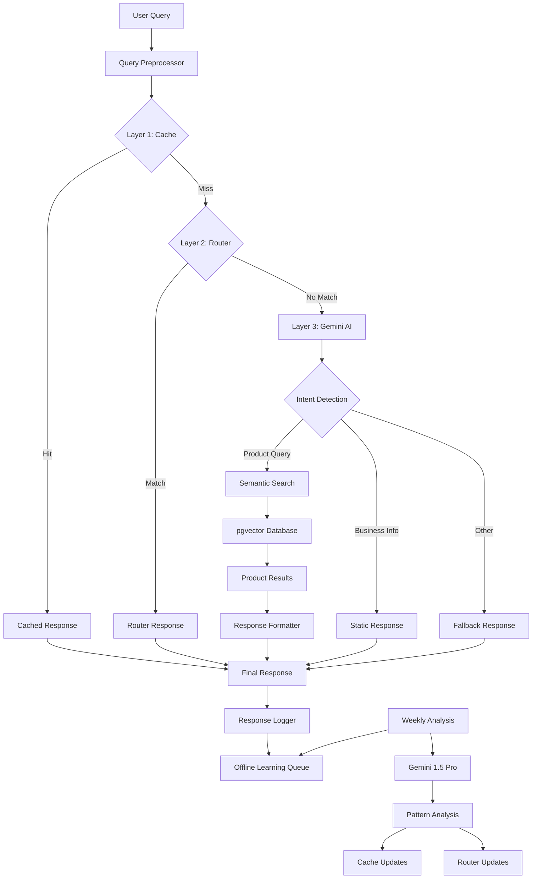

# 3 Katmanlı Hibrit Chatbot Sistemi - Design

## Overview

Bu sistem, maliyet optimizasyonu ve yüksek performansı birleştiren 3 katmanlı hibrit mimariye sahiptir. Her katman, farklı karmaşıklıktaki sorguları işleyerek toplam maliyeti minimize eder ve yanıt kalitesini maksimize eder.

## Architecture



## Components and Interfaces

### 1. Query Preprocessor

**Purpose:** Sorguları temizler ve normalize eder

**Key Features:**
- Türkçe karakter normalizasyonu
- Yazım hatası düzeltme
- Gereksiz kelime temizleme
- Query fingerprinting (cache key için)

**Interface:**
```python
class QueryPreprocessor:
    def normalize_query(self, query: str) -> str
    def generate_cache_key(self, query: str) -> str
    def extract_keywords(self, query: str) -> List[str]
    def correct_typos(self, query: str) -> str
```

### 2. Layer 1 - Cache System

**Purpose:** Birebir aynı sorguları anında yanıtlar

**Key Features:**
- Redis-based caching
- LRU eviction policy
- TTL-based expiration
- Hit rate monitoring

**Interface:**
```python
class CacheLayer:
    async def get_response(self, cache_key: str) -> Optional[str]
    async def set_response(self, cache_key: str, response: str, ttl: int) -> None
    async def invalidate_pattern(self, pattern: str) -> int
    def get_hit_rate(self) -> float
```

### 3. Layer 2 - Router System

**Purpose:** Anahtar kelime tabanlı hızlı yönlendirme

**Key Features:**
- Keyword-based routing
- Intent classification
- Static response mapping
- Dynamic rule updates

**Interface:**
```python
class RouterLayer:
    def match_keywords(self, query: str) -> Optional[str]
    def get_static_response(self, intent: str) -> str
    def add_routing_rule(self, keywords: List[str], intent: str) -> None
    def update_response(self, intent: str, response: str) -> None
```

### 4. Layer 3 - Gemini AI Integration

**Purpose:** Karmaşık sorguları AI ile işler

**Key Features:**
- Gemini 1.5 Flash integration
- Function calling support
- Response caching
- Fallback handling

**Interface:**
```python
class GeminiLayer:
    async def process_query(self, query: str) -> Dict[str, Any]
    async def detect_intent(self, query: str) -> str
    async def extract_entities(self, query: str) -> List[Dict]
    def get_api_usage_stats(self) -> Dict[str, int]
```

### 5. Semantic Search Engine

**Purpose:** Ürünleri anlamsal olarak arar

**Key Features:**
- Google Embedding API
- pgvector similarity search
- Multi-field product indexing
- Relevance scoring

**Interface:**
```python
class SemanticSearchEngine:
    async def create_embeddings(self, products: List[Dict]) -> None
    async def search_products(self, query: str, limit: int = 5) -> List[Dict]
    async def get_similar_products(self, product_id: str) -> List[Dict]
    def reindex_products(self) -> None
```

### 6. Offline Learning System

**Purpose:** Sistemin kendini geliştirmesi

**Key Features:**
- Query logging
- Pattern analysis
- Automatic rule generation
- A/B testing support

**Interface:**
```python
class OfflineLearningSystem:
    async def log_interaction(self, query: str, layer: int, response: str, success: bool) -> None
    async def analyze_patterns(self) -> Dict[str, Any]
    async def generate_cache_entries(self, patterns: List[str]) -> List[Dict]
    async def suggest_router_rules(self, patterns: List[str]) -> List[Dict]
```

## Data Models

### Query Log
```python
@dataclass
class QueryLog:
    id: str
    query: str
    processed_layer: int  # 1, 2, or 3
    intent: str
    response: str
    response_time_ms: int
    success: bool
    user_feedback: Optional[float]
    timestamp: datetime
```

### Cache Entry
```python
@dataclass
class CacheEntry:
    key: str
    query: str
    response: str
    hit_count: int
    created_at: datetime
    last_accessed: datetime
    ttl: int
```

### Router Rule
```python
@dataclass
class RouterRule:
    id: str
    keywords: List[str]
    intent: str
    response_template: str
    confidence_threshold: float
    usage_count: int
    success_rate: float
```

### Product Embedding
```python
@dataclass
class ProductEmbedding:
    product_id: str
    embedding: List[float]  # pgvector
    metadata: Dict[str, Any]
    indexed_text: str
    created_at: datetime
```

## Database Schema (PostgreSQL + pgvector)

```sql
-- Enable pgvector extension
CREATE EXTENSION IF NOT EXISTS vector;

-- Product embeddings table
CREATE TABLE product_embeddings (
    id SERIAL PRIMARY KEY,
    product_id VARCHAR(50) NOT NULL,
    embedding vector(384),  -- Google embedding dimension
    indexed_text TEXT NOT NULL,
    metadata JSONB,
    created_at TIMESTAMP DEFAULT NOW()
);

-- Create vector similarity index
CREATE INDEX ON product_embeddings USING ivfflat (embedding vector_cosine_ops);

-- Cache entries table
CREATE TABLE cache_entries (
    id SERIAL PRIMARY KEY,
    cache_key VARCHAR(255) UNIQUE NOT NULL,
    query TEXT NOT NULL,
    response TEXT NOT NULL,
    hit_count INTEGER DEFAULT 0,
    created_at TIMESTAMP DEFAULT NOW(),
    last_accessed TIMESTAMP DEFAULT NOW(),
    ttl INTEGER DEFAULT 3600
);

-- Router rules table
CREATE TABLE router_rules (
    id SERIAL PRIMARY KEY,
    keywords TEXT[] NOT NULL,
    intent VARCHAR(100) NOT NULL,
    response_template TEXT NOT NULL,
    confidence_threshold FLOAT DEFAULT 0.8,
    usage_count INTEGER DEFAULT 0,
    success_rate FLOAT DEFAULT 1.0,
    created_at TIMESTAMP DEFAULT NOW()
);

-- Query logs table
CREATE TABLE query_logs (
    id SERIAL PRIMARY KEY,
    query TEXT NOT NULL,
    processed_layer INTEGER NOT NULL,
    intent VARCHAR(100),
    response TEXT NOT NULL,
    response_time_ms INTEGER,
    success BOOLEAN DEFAULT TRUE,
    user_feedback FLOAT,
    timestamp TIMESTAMP DEFAULT NOW()
);
```

## Cost Analysis

### Monthly Cost Breakdown (100K queries)

| Component | Cost | Percentage |
|-----------|------|------------|
| Layer 1 (Cache) | $0 | 0% |
| Layer 2 (Router) | $0 | 0% |
| Layer 3 (Gemini) | $8-12 | 60-80% |
| Embedding API | $2-3 | 15-20% |
| Database (pgvector) | $0-5 | 0-30% |
| **Total** | **$10-20** | **100%** |

### Traffic Distribution (Optimized)
- Layer 1 (Cache): 40% of queries
- Layer 2 (Router): 30% of queries  
- Layer 3 (Gemini): 30% of queries

### Cost Optimization Strategies
1. **Cache Warming**: Proaktif olarak popüler sorguları cache'le
2. **Router Expansion**: Başarılı pattern'leri router'a ekle
3. **Batch Processing**: Embedding generation'ı batch'le
4. **Smart TTL**: Popüler cache entry'lerin TTL'ini artır

## Performance Targets

| Metric | Target | Measurement |
|--------|--------|-------------|
| Layer 1 Response Time | <5ms | 95th percentile |
| Layer 2 Response Time | <20ms | 95th percentile |
| Layer 3 Response Time | <500ms | 95th percentile |
| Cache Hit Rate | >40% | Daily average |
| Router Success Rate | >30% | Daily average |
| Overall Accuracy | >90% | User feedback |
| System Uptime | >99.5% | Monthly |

## Security Considerations

### Data Privacy
- Query logs anonymization
- PII detection and masking
- GDPR compliance
- Data retention policies

### API Security
- Rate limiting per user
- API key rotation
- Request validation
- DDoS protection

### Database Security
- Connection encryption
- Access control
- Query sanitization
- Backup encryption

## Monitoring and Alerting

### Key Metrics
- Layer distribution percentages
- Response time per layer
- API cost tracking
- Error rate monitoring
- Cache hit rate trends

### Alert Conditions
- Cache hit rate drops below 35%
- Layer 3 usage exceeds 40%
- Response time exceeds targets
- API costs exceed budget
- Error rate above 2%

## Deployment Strategy

### Phase 1: Foundation (Week 1)
- PostgreSQL + pgvector setup
- Basic 3-layer architecture
- Cache and router implementation
- Gemini integration

### Phase 2: Semantic Search (Week 2)
- Product embedding generation
- Semantic search implementation
- pgvector optimization
- Performance tuning

### Phase 3: Learning System (Week 3)
- Query logging implementation
- Offline analysis pipeline
- Pattern recognition
- Auto-update mechanisms

### Phase 4: Optimization (Week 4)
- Performance optimization
- Cost monitoring
- A/B testing framework
- Production deployment

## Success Metrics

### Technical Metrics
- Monthly cost under $15 (100K queries)
- 95% of queries under response time targets
- Cache hit rate above 40%
- System uptime above 99.5%

### Business Metrics
- Customer satisfaction above 4.5/5
- Query resolution rate above 90%
- Support ticket reduction by 50%
- Conversion rate improvement by 20%