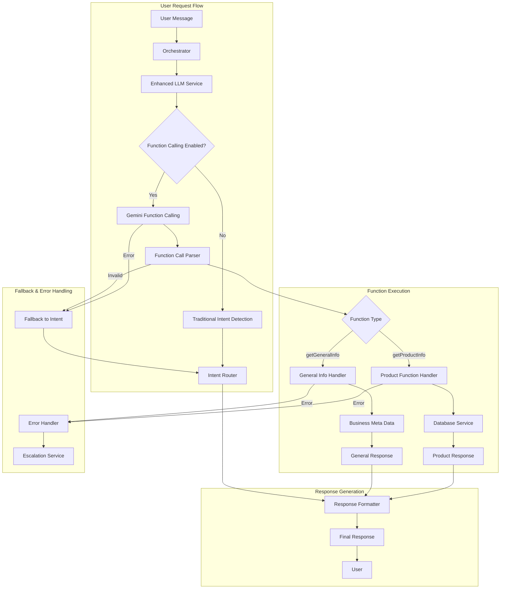
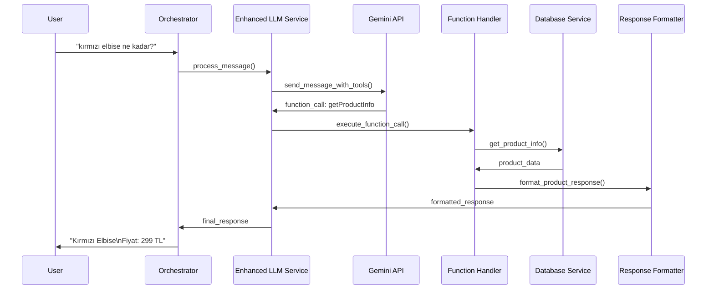

# Design Document

## Overview

Bu tasarım, mevcut orchestrator sistemine Gemini API'nin function calling özelliğini entegre ederek, müşteri sorgularını otomatik olarak yapısal fonksiyon çağrılarına dönüştürür. Sistem, kullanıcı niyetlerini tespit edip uygun fonksiyonları çağırarak veritabanından bilgi alır ve kullanıcıya anlamlı yanıtlar döndürür.

### Key Design Principles

1. **Backward Compatibility**: Mevcut LLM Service API'si değişmez, fallback mekanizması sağlanır
2. **Function-First Approach**: Intent detection yerine direkt fonksiyon çağrıları kullanılır
3. **Validation & Security**: Tüm fonksiyon parametreleri validate edilir
4. **Performance Optimization**: Caching ve batch processing desteklenir
5. **Multi-language Support**: Türkçe ve İngilizce desteklenir

## Architecture

### High-Level Architecture



### Function Calling Flow



## Components and Interfaces

### 1. Enhanced LLM Service

#### Core Enhancements
- Gemini function calling integration
- Function call parsing and validation
- Fallback mechanism to traditional intent detection
- Performance monitoring for both approaches

#### New Methods
```python
class EnhancedLLMService(LLMService):
    async def process_message_with_functions(self, prompt: str, session_id: str, isletme_id: str) -> Optional[Dict[str, Any]]
    async def _call_gemini_with_functions(self, prompt: str, session_id: str, isletme_id: str) -> Optional[Dict[str, Any]]
    async def _parse_function_call(self, response) -> Optional[Dict[str, Any]]
    async def _execute_function_call(self, function_name: str, args: Dict, session_id: str, isletme_id: str) -> str
    async def _validate_function_args(self, function_name: str, args: Dict) -> bool
    def _get_function_tools_definition(self) -> List[Dict]
    async def _fallback_to_intent_detection(self, prompt: str, session_id: str, isletme_id: str) -> Optional[Dict[str, Any]]
```

#### Function Tools Definition
```python
FUNCTION_TOOLS = [
    {
        "name": "getProductInfo",
        "description": "Ürün fiyat, stok, detay veya içerik bilgisi sorgular.",
        "parameters": {
            "type": "object",
            "properties": {
                "query_type": {
                    "type": "string", 
                    "description": "Niyet: 'fiyat', 'stok', 'ürün_detayı', 'içerik'.",
                    "enum": ["fiyat", "stok", "ürün_detayı", "içerik", "renk", "beden"]
                },
                "product_name": {
                    "type": "string", 
                    "description": "Ürünün adı."
                }
            },
            "required": ["query_type"]
        }
    },
    {
        "name": "getGeneralInfo",
        "description": "Şirketin iade, kargo, ödeme ve iletişim bilgilerini sorgular.",
        "parameters": {
            "type": "object",
            "properties": {
                "info_type": {
                    "type": "string", 
                    "description": "Niyet: 'iade_politikasi', 'kargo_detaylari', 'odeme_secenekleri', 'telefon_numarasi', 'website'.",
                    "enum": ["iade_politikasi", "kargo_detaylari", "odeme_secenekleri", "telefon_numarasi", "website", "adres", "iletisim"]
                }
            },
            "required": ["info_type"]
        }
    }
]
```

### 2. Function Call Handlers

#### Product Function Handler
```python
class ProductFunctionHandler:
    def __init__(self, db_service: DatabaseService):
        self.db_service = db_service
    
    async def handle_product_query(self, args: Dict, session_id: str, isletme_id: str) -> str:
        """
        getProductInfo fonksiyon çağrısını işle
        """
        query_type = args.get("query_type")
        product_name = args.get("product_name")
        
        # Ürün adı eksikse clarification iste
        if query_type in ["fiyat", "stok", "ürün_detayı"] and not product_name:
            return self._request_product_clarification(query_type)
        
        # Ürün bilgisini getir
        if product_name:
            product_info = await self.db_service.get_product_info(
                isletme_id, product_name, query_type
            )
            
            if product_info:
                return product_info
            else:
                return await self._handle_product_not_found(
                    isletme_id, product_name, query_type
                )
        
        return "Lütfen hangi ürün hakkında bilgi almak istediğinizi belirtin."
    
    def _request_product_clarification(self, query_type: str) -> str:
        """Ürün adı netleştirmesi iste"""
        if query_type == "fiyat":
            return "Elbette, hangi ürünün fiyatını öğrenmek istiyorsunuz?"
        elif query_type == "stok":
            return "Hangi ürünün stok durumunu kontrol etmek istiyorsunuz?"
        elif query_type == "ürün_detayı":
            return "Hangi ürün hakkında detaylı bilgi almak istiyorsunuz?"
        else:
            return "Hangi ürün hakkında bilgi almak istiyorsunuz?"
    
    async def _handle_product_not_found(self, isletme_id: str, product_name: str, query_type: str) -> str:
        """Ürün bulunamadığında alternatif öner"""
        similar_products = await self.db_service.find_similar_products(
            isletme_id, product_name, limit=3
        )
        
        if similar_products:
            products_list = ", ".join(similar_products)
            return f"'{product_name}' bulunamadı. Şunları kastedebilir misiniz: {products_list}?"
        else:
            return f"'{product_name}' ürünü bulunamadı. Mevcut ürünlerimizi görmek için katalog diyebilirsiniz."
```

#### General Info Function Handler
```python
class GeneralInfoFunctionHandler:
    def __init__(self, db_service: DatabaseService):
        self.db_service = db_service
        
        # Standart yanıtlar
        self.standard_responses = {
            "telefon_numarasi": "Telefon numaramız: {phone}",
            "iade_politikasi": "14 gün içinde koşulsuz iade hakkınız bulunmaktadır.",
            "kargo_detaylari": "Kargo ücretsiz, 1-3 iş günü içinde teslim.",
            "odeme_secenekleri": "Kredi kartı, havale/EFT ve kapıda ödeme seçenekleri mevcuttur.",
            "website": "Web sitemiz: {website}",
            "adres": "Adresimiz: {address}",
            "iletisim": "İletişim bilgilerimiz: Telefon: {phone}, E-posta: {email}"
        }
    
    async def handle_general_info(self, args: Dict, session_id: str, isletme_id: str) -> str:
        """
        getGeneralInfo fonksiyon çağrısını işle
        """
        info_type = args.get("info_type")
        
        # Önce işletme özel bilgisini kontrol et
        business_info = await self.db_service.get_business_meta_info(isletme_id, info_type)
        
        if business_info:
            return business_info
        
        # Standart yanıt varsa kullan
        if info_type in self.standard_responses:
            template = self.standard_responses[info_type]
            
            # Template'de placeholder varsa işletme bilgilerini getir
            if "{" in template:
                business_data = await self.db_service.get_business_info(isletme_id)
                if business_data:
                    return template.format(
                        phone=business_data.get("phone", "Belirtilmemiş"),
                        email=business_data.get("email", "Belirtilmemiş"),
                        website=business_data.get("website", "Belirtilmemiş"),
                        address=business_data.get("address", "Belirtilmemiş")
                    )
            
            return template
        
        return f"'{info_type}' hakkında bilgi şu anda mevcut değil. Müşteri hizmetlerimizle iletişime geçebilirsiniz."
```

### 3. Function Call Parser and Validator

#### Function Call Parser
```python
class FunctionCallParser:
    def __init__(self):
        self.valid_functions = {"getProductInfo", "getGeneralInfo"}
        self.function_schemas = self._load_function_schemas()
    
    def parse_function_call(self, gemini_response) -> Optional[Dict[str, Any]]:
        """
        Gemini function call response'unu parse et
        """
        try:
            if not hasattr(gemini_response, 'candidates'):
                return None
            
            candidate = gemini_response.candidates[0]
            if not hasattr(candidate.content, 'parts'):
                return None
            
            part = candidate.content.parts[0]
            if not hasattr(part, 'function_call'):
                return None
            
            function_call = part.function_call
            
            return {
                "function_name": function_call.name,
                "arguments": {key: value for key, value in function_call.args.items()},
                "raw_response": gemini_response
            }
            
        except Exception as e:
            logger.error(f"Function call parsing error: {str(e)}")
            return None
    
    def validate_function_call(self, function_name: str, arguments: Dict) -> bool:
        """
        Function call'ın geçerliliğini kontrol et
        """
        if function_name not in self.valid_functions:
            logger.error(f"Invalid function name: {function_name}")
            return False
        
        schema = self.function_schemas.get(function_name)
        if not schema:
            return False
        
        return self._validate_against_schema(arguments, schema)
    
    def _validate_against_schema(self, arguments: Dict, schema: Dict) -> bool:
        """
        Arguments'ı schema'ya göre validate et
        """
        try:
            required_fields = schema.get("required", [])
            properties = schema.get("properties", {})
            
            # Required fields kontrolü
            for field in required_fields:
                if field not in arguments:
                    logger.error(f"Missing required field: {field}")
                    return False
            
            # Type ve enum kontrolü
            for field, value in arguments.items():
                if field in properties:
                    prop_schema = properties[field]
                    
                    # Type kontrolü
                    expected_type = prop_schema.get("type")
                    if expected_type == "string" and not isinstance(value, str):
                        logger.error(f"Invalid type for {field}: expected string")
                        return False
                    
                    # Enum kontrolü
                    enum_values = prop_schema.get("enum")
                    if enum_values and value not in enum_values:
                        logger.error(f"Invalid enum value for {field}: {value}")
                        return False
            
            return True
            
        except Exception as e:
            logger.error(f"Schema validation error: {str(e)}")
            return False
```

### 4. Configuration Management

#### Function Calling Configuration
```python
@dataclass
class FunctionCallingConfig:
    enabled: bool = True
    fallback_to_intent: bool = True
    max_retries: int = 2
    timeout_seconds: int = 10
    supported_languages: List[str] = field(default_factory=lambda: ["tr", "en"])
    
    # Performance settings
    cache_function_responses: bool = True
    cache_ttl_seconds: int = 300  # 5 dakika
    
    # Security settings
    validate_all_parameters: bool = True
    sanitize_inputs: bool = True
    rate_limit_per_session: int = 50  # per hour
    
    # Monitoring
    log_all_function_calls: bool = True
    track_performance_metrics: bool = True
```

#### Settings Integration
```python
# orchestrator/config/settings.py'ye eklenecek
class Settings(BaseSettings):
    # ... existing settings ...
    
    # Function Calling Settings
    function_calling_enabled: bool = Field(default=True, env="FUNCTION_CALLING_ENABLED")
    function_calling_fallback: bool = Field(default=True, env="FUNCTION_CALLING_FALLBACK")
    function_calling_timeout: int = Field(default=10, env="FUNCTION_CALLING_TIMEOUT")
    function_calling_cache_ttl: int = Field(default=300, env="FUNCTION_CALLING_CACHE_TTL")
    
    # Gemini Function Calling
    gemini_function_model: str = Field(default="gemini-1.5-flash-latest", env="GEMINI_FUNCTION_MODEL")
    gemini_function_temperature: float = Field(default=0.1, env="GEMINI_FUNCTION_TEMPERATURE")
```

## Data Models

### Function Call Models
```python
@dataclass
class FunctionCall:
    function_name: str
    arguments: Dict[str, Any]
    session_id: str
    isletme_id: str
    timestamp: datetime
    execution_time_ms: Optional[int] = None
    success: bool = False
    error_message: Optional[str] = None
    response: Optional[str] = None

@dataclass
class FunctionCallResult:
    success: bool
    response: str
    execution_time_ms: int
    cached: bool = False
    error_details: Optional[str] = None
    fallback_used: bool = False

@dataclass
class FunctionPerformanceMetrics:
    function_name: str
    total_calls: int
    successful_calls: int
    average_execution_time_ms: float
    cache_hit_rate: float
    error_rate: float
    last_updated: datetime
```

### Database Schema Extensions

#### Function Call Logs Table
```sql
CREATE TABLE function_call_logs (
    id UUID PRIMARY KEY DEFAULT gen_random_uuid(),
    session_id VARCHAR(255) NOT NULL,
    business_id VARCHAR(255) NOT NULL,
    function_name VARCHAR(100) NOT NULL,
    arguments JSONB NOT NULL,
    response TEXT,
    execution_time_ms INTEGER,
    success BOOLEAN DEFAULT false,
    error_message TEXT,
    cached BOOLEAN DEFAULT false,
    fallback_used BOOLEAN DEFAULT false,
    created_at TIMESTAMP DEFAULT NOW(),
    
    INDEX idx_function_call_logs_session (session_id),
    INDEX idx_function_call_logs_business (business_id),
    INDEX idx_function_call_logs_function (function_name),
    INDEX idx_function_call_logs_created (created_at)
);
```

#### Function Performance Stats Table
```sql
CREATE TABLE function_performance_stats (
    id UUID PRIMARY KEY DEFAULT gen_random_uuid(),
    business_id VARCHAR(255) NOT NULL,
    function_name VARCHAR(100) NOT NULL,
    date DATE NOT NULL,
    total_calls INTEGER DEFAULT 0,
    successful_calls INTEGER DEFAULT 0,
    total_execution_time_ms BIGINT DEFAULT 0,
    cache_hits INTEGER DEFAULT 0,
    errors INTEGER DEFAULT 0,
    created_at TIMESTAMP DEFAULT NOW(),
    updated_at TIMESTAMP DEFAULT NOW(),
    
    UNIQUE(business_id, function_name, date),
    INDEX idx_function_stats_business_date (business_id, date),
    INDEX idx_function_stats_function (function_name)
);
```

## Error Handling

### Error Categories and Strategies

1. **Function Call Parsing Errors**
   - Malformed function call response
   - Missing function name or arguments
   - Strategy: Fallback to intent detection

2. **Function Validation Errors**
   - Invalid function name
   - Missing required parameters
   - Invalid parameter types or values
   - Strategy: Return validation error message, log for improvement

3. **Function Execution Errors**
   - Database connection issues
   - Product not found
   - Business info unavailable
   - Strategy: Graceful error messages, escalation if needed

4. **Gemini API Errors**
   - Rate limiting
   - Authentication errors
   - Network timeouts
   - Strategy: Retry with exponential backoff, fallback to intent detection

### Error Recovery Implementation
```python
class FunctionCallErrorHandler:
    async def handle_parsing_error(self, error: Exception, prompt: str, session_id: str, isletme_id: str) -> str:
        """Function call parsing hatası"""
        logger.warning(f"Function call parsing failed: {str(error)}")
        
        # Fallback to traditional intent detection
        return await self.llm_service._fallback_to_intent_detection(
            prompt, session_id, isletme_id
        )
    
    async def handle_validation_error(self, function_name: str, arguments: Dict, error: str) -> str:
        """Function validation hatası"""
        logger.error(f"Function validation failed for {function_name}: {error}")
        
        if function_name == "getProductInfo" and "product_name" in error:
            return "Hangi ürün hakkında bilgi almak istiyorsunuz?"
        elif function_name == "getGeneralInfo":
            return "Hangi konuda bilgi almak istiyorsunuz? (iade, kargo, ödeme, iletişim)"
        
        return "Sorunuzu daha net bir şekilde belirtebilir misiniz?"
    
    async def handle_execution_error(self, function_name: str, error: Exception, session_id: str, isletme_id: str) -> str:
        """Function execution hatası"""
        logger.error(f"Function execution failed for {function_name}: {str(error)}")
        
        # Critical errors için escalation
        if isinstance(error, DatabaseConnectionError):
            return await self._escalate_technical_error(session_id, isletme_id, str(error))
        
        # User-friendly error messages
        return "Üzgünüm, şu anda bu bilgiyi alamıyorum. Lütfen daha sonra tekrar deneyin."
```

## Testing Strategy

### Unit Tests
- Function call parsing tests
- Function validation tests
- Handler logic tests
- Error handling tests

### Integration Tests
- End-to-end function calling flow
- Fallback mechanism tests
- Database integration tests
- Performance benchmarks

### Test Data and Scenarios
```python
# Test scenarios
TEST_SCENARIOS = [
    {
        "input": "kırmızı elbise ne kadar?",
        "expected_function": "getProductInfo",
        "expected_args": {"query_type": "fiyat", "product_name": "kırmızı elbise"},
        "expected_response_contains": ["fiyat", "TL"]
    },
    {
        "input": "iade var mı?",
        "expected_function": "getGeneralInfo", 
        "expected_args": {"info_type": "iade_politikasi"},
        "expected_response_contains": ["iade", "gün"]
    },
    {
        "input": "fiyatı nedir?",
        "expected_function": "getProductInfo",
        "expected_args": {"query_type": "fiyat"},
        "expected_response_contains": ["hangi ürün"]
    }
]
```

## Performance Optimization

### Caching Strategy
- Function response caching (5 dakika TTL)
- Business info caching (1 saat TTL)
- Product info caching (30 dakika TTL)
- Negative result caching (1 dakika TTL)

### Batch Processing
- Multiple function calls in single request
- Parallel execution where possible
- Connection pooling optimization

### Monitoring and Metrics
- Function call success rates
- Average execution times
- Cache hit rates
- Error distribution
- Fallback usage statistics

## Security Considerations

### Input Validation
- SQL injection prevention
- XSS protection
- Parameter sanitization
- Rate limiting per session

### Access Control
- Business-specific data isolation
- Function access permissions
- API key validation
- Request logging and auditing

### Data Privacy
- PII detection and masking
- Secure parameter logging
- GDPR compliance considerations
- Data retention policies

## Migration Strategy

### Phase 1: Infrastructure Setup
- Enhanced LLM Service implementation
- Function handlers development
- Database schema updates
- Configuration management

### Phase 2: Gradual Rollout
- A/B testing with percentage of traffic
- Performance monitoring
- Error rate tracking
- Fallback mechanism validation

### Phase 3: Full Deployment
- Complete migration to function calling
- Traditional intent detection as fallback only
- Performance optimization
- Monitoring dashboard setup

### Rollback Plan
- Feature flag for instant disable
- Automatic fallback on high error rates
- Database rollback scripts
- Configuration restore procedures