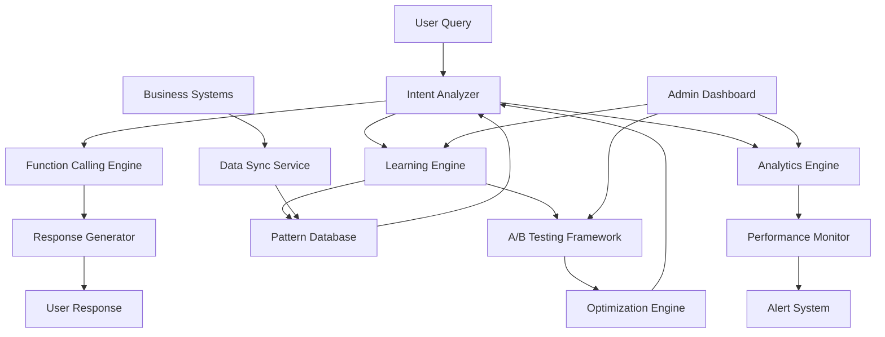

# Intent Improvement System - Design

## Overview

Bu sistem, mevcut Gemini Function Calling chatbot'unu sürekli öğrenen ve kendini geliştiren bir platforma dönüştürür. Machine learning, real-time analytics ve automated optimization kullanarak kullanıcı deneyimini sürekli iyileştirir.

## Architecture



## Components and Interfaces

### 1. Enhanced Intent Analyzer

**Purpose:** Gelişmiş intent detection ve confidence scoring

**Key Features:**
- Multi-model ensemble (Gemini + local models)
- Dynamic threshold adjustment
- Context-aware intent detection
- Fallback intent suggestions

**Interface:**
```python
class EnhancedIntentAnalyzer:
    async def analyze_intent(self, query: str, context: Dict) -> IntentResult
    async def get_confidence_threshold(self, intent_type: str) -> float
    async def suggest_alternatives(self, failed_query: str) -> List[str]
    async def update_patterns(self, successful_patterns: List[Pattern]) -> None
```

### 2. Learning Engine

**Purpose:** Sürekli öğrenme ve pattern optimization

**Key Features:**
- Real-time pattern learning
- Success/failure analysis
- Automatic intent creation
- Seasonal pattern detection

**Interface:**
```python
class LearningEngine:
    async def learn_from_interaction(self, interaction: Interaction) -> None
    async def generate_new_patterns(self) -> List[Pattern]
    async def optimize_existing_patterns(self) -> OptimizationResult
    async def detect_seasonal_trends(self) -> List[Trend]
```

### 3. Performance Monitor

**Purpose:** Real-time performance tracking ve optimization

**Key Features:**
- Response time monitoring
- Cache hit rate tracking
- Error rate analysis
- Resource utilization monitoring

**Interface:**
```python
class PerformanceMonitor:
    async def track_response_time(self, query_id: str, duration: float) -> None
    async def monitor_cache_performance(self) -> CacheMetrics
    async def analyze_error_patterns(self) -> List[ErrorPattern]
    async def suggest_optimizations(self) -> List[Optimization]
```

### 4. A/B Testing Framework

**Purpose:** Farklı stratejileri test etme ve optimization

**Key Features:**
- Random user assignment
- Statistical significance testing
- Automatic rollback
- Multi-variant testing

**Interface:**
```python
class ABTestingFramework:
    async def create_test(self, test_config: TestConfig) -> Test
    async def assign_user_to_group(self, user_id: str, test_id: str) -> str
    async def track_test_metrics(self, test_id: str, metrics: Dict) -> None
    async def analyze_test_results(self, test_id: str) -> TestResults
```

### 5. Analytics Engine

**Purpose:** Kapsamlı analytics ve business intelligence

**Key Features:**
- Query pattern analysis
- Customer behavior tracking
- Product demand forecasting
- Satisfaction scoring

**Interface:**
```python
class AnalyticsEngine:
    async def analyze_query_patterns(self, timeframe: str) -> PatternAnalysis
    async def track_customer_journey(self, session_id: str) -> Journey
    async def forecast_demand(self, product_category: str) -> Forecast
    async def calculate_satisfaction_score(self) -> float
```

## Data Models

### Intent Pattern
```python
@dataclass
class IntentPattern:
    id: str
    pattern_text: str
    intent_type: str
    confidence_threshold: float
    success_rate: float
    usage_count: int
    created_at: datetime
    last_used: datetime
    seasonal_weight: float
```

### Interaction Log
```python
@dataclass
class InteractionLog:
    id: str
    session_id: str
    query: str
    detected_intent: str
    confidence: float
    response: str
    response_time_ms: int
    user_satisfaction: Optional[float]
    timestamp: datetime
    context: Dict[str, Any]
```

### Performance Metrics
```python
@dataclass
class PerformanceMetrics:
    timestamp: datetime
    avg_response_time: float
    cache_hit_rate: float
    error_rate: float
    concurrent_users: int
    intent_accuracy: float
    user_satisfaction: float
```

## Error Handling

### 1. Intent Detection Failures
- Fallback to similarity search
- Suggest alternative queries
- Log for pattern learning
- Escalate to human if needed

### 2. Performance Degradation
- Automatic scaling triggers
- Cache warming strategies
- Load balancing activation
- Circuit breaker patterns

### 3. Learning System Failures
- Rollback to previous patterns
- Manual pattern override
- Alert system administrators
- Maintain service availability

## Testing Strategy

### 1. Unit Tests
- Intent pattern matching
- Learning algorithm accuracy
- Performance metric calculations
- A/B test statistical functions

### 2. Integration Tests
- End-to-end query processing
- Database consistency
- Cache synchronization
- External system integration

### 3. Performance Tests
- Load testing with 1000+ concurrent users
- Memory usage under sustained load
- Database query optimization
- Cache performance validation

### 4. A/B Tests
- Response strategy comparison
- UI/UX improvements
- Algorithm performance
- Customer satisfaction impact

## Security Considerations

### 1. Data Privacy
- PII detection and masking
- Conversation data encryption
- GDPR compliance
- Data retention policies

### 2. System Security
- API rate limiting
- Input validation
- SQL injection prevention
- Access control

### 3. Monitoring
- Anomaly detection
- Security event logging
- Intrusion detection
- Compliance auditing

## Deployment Strategy

### Phase 1: Foundation (Week 1-2)
- Enhanced intent analyzer
- Basic learning engine
- Performance monitoring
- Database schema updates

### Phase 2: Intelligence (Week 3-4)
- Advanced learning algorithms
- A/B testing framework
- Analytics engine
- Admin dashboard

### Phase 3: Optimization (Week 5-6)
- Performance optimizations
- Advanced caching
- Load balancing
- Security hardening

### Phase 4: Scale (Week 7-8)
- Multi-language support
- Business system integration
- Advanced analytics
- Production deployment

## Monitoring and Alerting

### Key Metrics
- Intent accuracy rate (target: >95%)
- Response time (target: <200ms)
- User satisfaction (target: >4.5/5)
- System uptime (target: 99.9%)

### Alert Conditions
- Intent accuracy drops below 90%
- Response time exceeds 500ms
- Error rate above 1%
- Cache hit rate below 60%

### Dashboard Components
- Real-time query processing
- Intent accuracy trends
- Performance metrics
- User satisfaction scores
- A/B test results