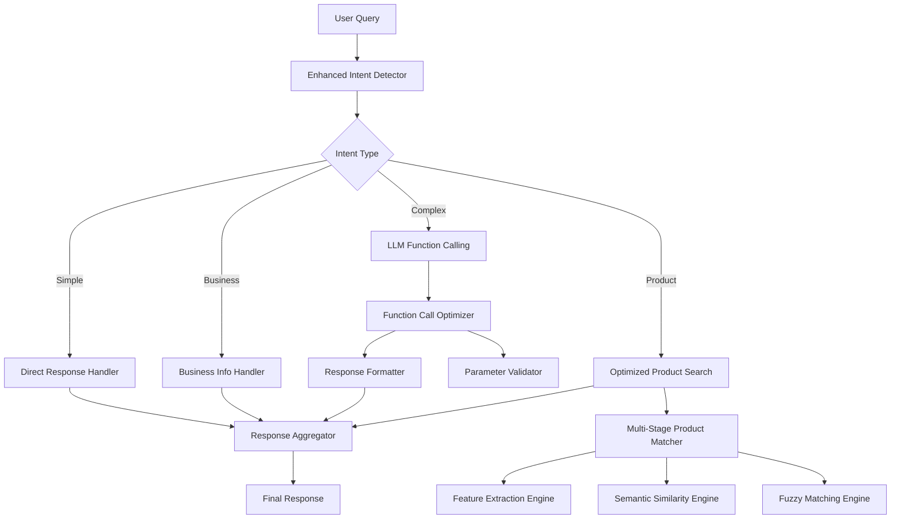
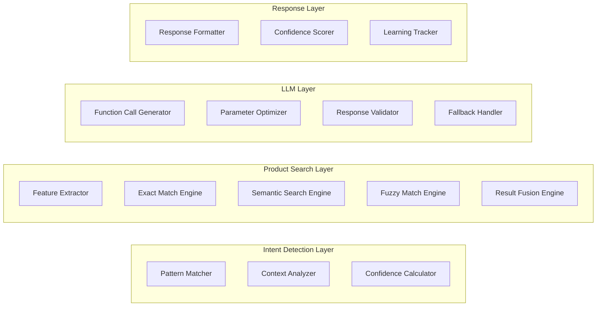

# Design Document

## Overview

Bu tasarım, mevcut chatbot sistemindeki kritik sorunları çözmek için kapsamlı bir LLM ve function calling optimizasyon sistemi sunar. Sistem, Gemini 2.0 Flash Lite modelini optimize ederek doğru ürün eşleştirmesi, güvenilir function calling ve akıllı yanıt mekanizması sağlayacaktır.

### Current Problems Analysis

1. **Product Search Issues**: "Kolu Omzu ve Yakası Dantelli Önü Düğmeli Gecelik" sorgusu için "Afrika Etnik Baskılı Dantelli Gecelik" döndürülüyor
2. **Function Calling Failures**: Pattern matching yetersiz, LLM'e gönderilmeyen sorgular
3. **Poor Intent Detection**: Basit keyword matching, context awareness yok
4. **Ineffective Embeddings**: Semantic search düzgün çalışmıyor
5. **Complex Fallback Chain**: Çok fazla fallback, performans sorunu

## Architecture

### High-Level Architecture



### Component Architecture



## Components and Interfaces

### 1. Enhanced Intent Detector

**Purpose**: Akıllı intent detection with context awareness

**Key Features**:
- Multi-stage pattern matching
- Context-aware analysis
- Confidence scoring
- Turkish language optimization

**Interface**:
```python
class EnhancedIntentDetector:
    async def detect_intent(self, query: str, context: Dict) -> IntentResult
    def calculate_confidence(self, matches: List) -> float
    def extract_entities(self, query: str) -> List[Entity]
```

**Implementation Strategy**:
- Exact pattern matching for common queries
- Feature-based analysis for product queries
- Context resolution for follow-up questions
- Confidence thresholding for LLM routing

### 2. Multi-Stage Product Matcher

**Purpose**: Accurate product matching with multiple algorithms

**Key Features**:
- Exact feature matching (highest priority)
- Semantic similarity matching
- Fuzzy string matching
- Result fusion and ranking

**Interface**:
```python
class MultiStageProductMatcher:
    async def search_products(self, query: str, products: List) -> SearchResult
    def extract_product_features(self, query: str) -> List[Feature]
    def calculate_match_score(self, query_features: List, product_features: List) -> float
    def fuse_results(self, results: Dict[str, List]) -> List[Match]
```

**Matching Stages**:
1. **Exact Feature Match**: Direct feature-to-feature matching
2. **Weighted Semantic Match**: Feature-weighted semantic similarity
3. **Fuzzy Text Match**: String similarity with Turkish normalization
4. **Result Fusion**: Combine and rank all results

### 3. Feature Extraction Engine

**Purpose**: Extract structured features from Turkish product queries

**Key Features**:
- Turkish-specific feature extraction
- Synonym mapping
- Feature weighting
- Category classification

**Interface**:
```python
class FeatureExtractionEngine:
    def extract_features(self, text: str) -> List[ProductFeature]
    def normalize_turkish_text(self, text: str) -> str
    def map_synonyms(self, feature: str) -> List[str]
    def calculate_feature_weight(self, feature: ProductFeature) -> float
```

**Feature Categories**:
- Garment Type (gecelik, pijama, sabahlık)
- Style Details (dantelli, düğmeli, dekolteli)
- Target Group (hamile, lohusa, büyük beden)
- Colors (siyah, beyaz, ekru)
- Materials and Patterns

### 4. LLM Function Call Optimizer

**Purpose**: Optimize Gemini function calling for better accuracy

**Key Features**:
- Smart function selection
- Parameter validation
- Response optimization
- Error handling

**Interface**:
```python
class LLMFunctionCallOptimizer:
    async def optimize_function_call(self, query: str, context: Dict) -> FunctionCall
    def validate_parameters(self, function_call: FunctionCall) -> ValidationResult
    def format_response(self, function_result: Dict) -> str
    def handle_function_errors(self, error: Exception) -> FallbackResponse
```

**Optimization Strategies**:
- Pre-processing query for better function selection
- Parameter validation before LLM call
- Response post-processing for consistency
- Intelligent fallback mechanisms

### 5. Response Aggregator

**Purpose**: Combine results from different components into coherent responses

**Key Features**:
- Multi-source result fusion
- Confidence-based selection
- Response formatting
- Learning integration

**Interface**:
```python
class ResponseAggregator:
    def aggregate_responses(self, responses: List[ComponentResponse]) -> FinalResponse
    def calculate_overall_confidence(self, responses: List) -> float
    def format_final_response(self, aggregated: AggregatedResponse) -> str
    def track_response_quality(self, response: FinalResponse, feedback: Dict) -> None
```

## Data Models

### Core Data Models

```python
@dataclass
class ProductFeature:
    value: str
    category: FeatureCategory
    weight: float
    confidence: float
    synonyms: List[str]
    normalized_value: str

@dataclass
class IntentResult:
    intent: str
    confidence: float
    entities: List[Entity]
    context: Dict[str, Any]
    requires_llm: bool
    function_call: Optional[FunctionCall]

@dataclass
class SearchMatch:
    product: Dict[str, Any]
    score: float
    confidence: float
    matched_features: List[str]
    match_explanation: str
    method: str

@dataclass
class FunctionCall:
    name: str
    parameters: Dict[str, Any]
    confidence: float
    validation_status: str
    expected_response_type: str

@dataclass
class OptimizedResponse:
    content: str
    confidence: float
    method: str
    processing_time_ms: int
    function_calls_made: List[FunctionCall]
    learning_data: Dict[str, Any]
```

### Database Schema Extensions

```sql
-- Enhanced product search tracking
CREATE TABLE search_queries (
    id SERIAL PRIMARY KEY,
    query TEXT NOT NULL,
    extracted_features JSONB,
    search_results JSONB,
    selected_result_id INTEGER,
    confidence_score FLOAT,
    processing_time_ms INTEGER,
    created_at TIMESTAMP DEFAULT NOW()
);

-- Function call optimization tracking
CREATE TABLE function_call_logs (
    id SERIAL PRIMARY KEY,
    query TEXT NOT NULL,
    function_name VARCHAR(100),
    parameters JSONB,
    response JSONB,
    success BOOLEAN,
    confidence_score FLOAT,
    processing_time_ms INTEGER,
    created_at TIMESTAMP DEFAULT NOW()
);

-- Learning and improvement tracking
CREATE TABLE response_feedback (
    id SERIAL PRIMARY KEY,
    query TEXT NOT NULL,
    response TEXT NOT NULL,
    user_satisfaction INTEGER, -- 1-5 scale
    was_helpful BOOLEAN,
    improvement_suggestions TEXT,
    created_at TIMESTAMP DEFAULT NOW()
);
```

## Error Handling

### Error Categories and Strategies

1. **Product Search Errors**
   - No matches found → Suggest similar products
   - Multiple ambiguous matches → Ask for clarification
   - Feature extraction failure → Fall back to keyword search

2. **Function Calling Errors**
   - Invalid parameters → Parameter validation and correction
   - LLM API failure → Cached response or human handoff
   - Timeout errors → Quick fallback response

3. **Intent Detection Errors**
   - Low confidence → Ask clarifying questions
   - Ambiguous intent → Present options to user
   - Unknown intent → Graceful degradation to human support

### Error Recovery Mechanisms

```python
class ErrorRecoveryManager:
    def handle_search_error(self, error: SearchError, query: str) -> RecoveryResponse
    def handle_function_error(self, error: FunctionError, context: Dict) -> RecoveryResponse
    def handle_llm_error(self, error: LLMError, fallback_data: Dict) -> RecoveryResponse
    def escalate_to_human(self, context: Dict) -> HumanHandoffResponse
```

## Testing Strategy

### Testing Approach

1. **Unit Testing**
   - Individual component testing
   - Feature extraction accuracy
   - Intent detection precision
   - Function call validation

2. **Integration Testing**
   - End-to-end query processing
   - Multi-component interaction
   - Error handling flows
   - Performance benchmarking

3. **Performance Testing**
   - Response time optimization
   - Concurrent user handling
   - Memory usage optimization
   - LLM API rate limiting

4. **Accuracy Testing**
   - Product search precision/recall
   - Intent detection accuracy
   - Function call success rate
   - User satisfaction metrics

### Test Data Sets

```python
# Product search test cases
PRODUCT_SEARCH_TESTS = [
    {
        "query": "Kolu Omzu ve Yakası Dantelli Önü Düğmeli Gecelik",
        "expected_features": ["kol", "omuz", "yaka", "dantelli", "önü düğmeli", "gecelik"],
        "expected_matches": ["18K18200", "18K18208", "18K18427"],  # Exact matches
        "min_confidence": 0.8
    },
    {
        "query": "siyah hamile gecelik",
        "expected_features": ["siyah", "hamile", "gecelik"],
        "expected_matches": ["hamile gecelik products with black color"],
        "min_confidence": 0.7
    }
]

# Intent detection test cases
INTENT_DETECTION_TESTS = [
    {
        "query": "fiyat soracaktım",
        "expected_intent": "clarification_needed",
        "expected_response": "Hangi ürünün fiyatını öğrenmek istiyorsunuz?",
        "min_confidence": 0.9
    }
]
```

### Performance Benchmarks

- **Response Time**: < 2 seconds for 95% of queries
- **Search Accuracy**: > 85% precision for product searches
- **Intent Detection**: > 90% accuracy for common intents
- **Function Call Success**: > 95% success rate
- **User Satisfaction**: > 4.0/5.0 average rating

## Implementation Phases

### Phase 1: Core Optimization (Week 1-2)
- Enhanced intent detection
- Multi-stage product matching
- Feature extraction engine
- Basic error handling

### Phase 2: LLM Integration (Week 3)
- Function call optimization
- Parameter validation
- Response formatting
- Advanced error recovery

### Phase 3: Performance & Learning (Week 4)
- Performance optimization
- Learning system integration
- Comprehensive testing
- Monitoring and analytics

### Phase 4: Production Deployment (Week 5)
- Production deployment
- Monitoring setup
- User feedback collection
- Continuous improvement

## Monitoring and Analytics

### Key Metrics

1. **Performance Metrics**
   - Average response time
   - 95th percentile response time
   - Error rate by component
   - LLM API usage and costs

2. **Accuracy Metrics**
   - Product search precision/recall
   - Intent detection accuracy
   - Function call success rate
   - User satisfaction scores

3. **Business Metrics**
   - Query resolution rate
   - Human handoff rate
   - User engagement metrics
   - Conversion rates

### Monitoring Dashboard

```python
class MonitoringDashboard:
    def track_query_performance(self, query: str, response_time: int, success: bool)
    def track_search_accuracy(self, query: str, results: List, user_selection: str)
    def track_user_satisfaction(self, session_id: str, rating: int, feedback: str)
    def generate_performance_report(self, time_period: str) -> Report
```

This design provides a comprehensive solution to the current LLM and function calling issues, with focus on accurate product matching, reliable function calling, and excellent user experience.