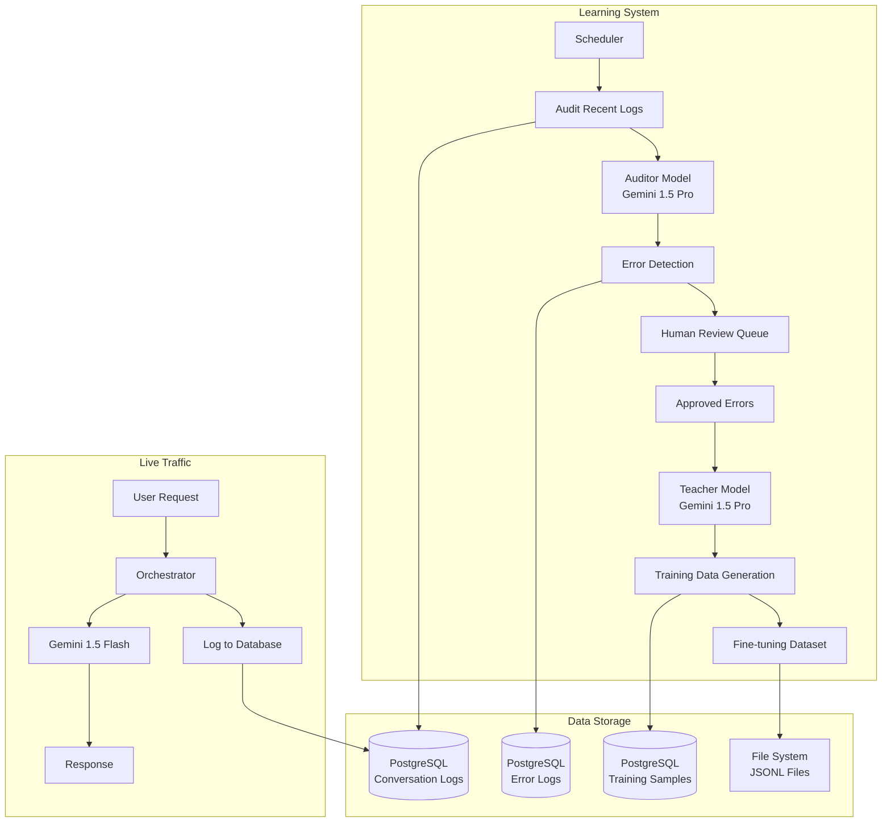
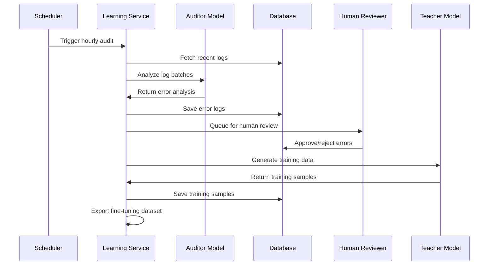

# Design Document

## Overview

Bu tasarım, mevcut chatbot altyapısına "Öğretmen-Öğrenci" ve "AI Denetçi" mimarilerini entegre ederek, sistemin kendi yaptığı hataları otomatik olarak tespit etmesini ve bu hatalardan öğrenerek kendini geliştirmesini sağlar. Sistem, canlı trafikte hızlı Gemini 1.5 Flash modeli kullanırken, arka planda güçlü Gemini 1.5 Pro modelleri ile kalite kontrolü ve eğitim verisi üretimi yapar.

### Key Design Principles

1. **Non-Intrusive**: Mevcut canlı sistemi etkilemeden arka planda çalışır
2. **Human-in-the-Loop**: Kritik kararlar için insan onayı gerektirir
3. **Incremental Learning**: Sürekli ve kademeli öğrenme sağlar
4. **Quality Assurance**: Çoklu doğrulama katmanları ile kalite garantisi
5. **Scalable Architecture**: Yüksek log hacimlerini işleyebilir

## Architecture

### High-Level Architecture



### Component Interaction Flow



## Components and Interfaces

### 1. Enhanced Learning Service

#### Core Responsibilities
- Periyodik log denetleme
- AI model koordinasyonu
- İnsan onayı süreç yönetimi
- Eğitim verisi üretimi
- İstatistik ve raporlama

#### Key Methods
```python
class LearningService:
    async def initialize() -> bool
    async def audit_recent_logs() -> Dict[str, Any]
    async def prepare_new_training_data() -> Dict[str, Any]
    async def process_human_feedback(feedback_id: str, is_approved: bool, corrections: Optional[Dict]) -> bool
    async def trigger_manual_audit(session_id: Optional[str], log_ids: Optional[List[str]], count: int) -> Dict
    async def generate_fine_tuning_dataset() -> Dict[str, Any]
    async def get_audit_stats() -> Dict[str, Any]
    async def update_learning_config(new_config: Dict[str, Any]) -> Dict
```

### 2. Auditor Model Interface

#### Purpose
Orkestratör'ün loglarını analiz edip, botun "doğru" sandığı ama aslında "yanlış" olan cevapları tespit eder.

#### Input Format
```python
{
    "logs": [
        {
            "log_id": "uuid",
            "session_id": "session_uuid", 
            "isletme_id": "business_id",
            "input_text": "Kullanıcının mesajı",
            "output_json": {
                "intent": "detected_intent",
                "entities": {...},
                "confidence": 0.85,
                "response": "Bot yanıtı"
            },
            "timestamp": "2024-01-01T10:00:00Z"
        }
    ]
}
```

#### Output Format
```python
[
    {
        "log_id": "uuid",
        "status": "Doğru" | "Hatalı",
        "error_type": "intent_error" | "entity_error" | "confidence_error" | "response_error",
        "explanation": "Hata açıklaması",
        "correct_json": {
            "intent": "correct_intent",
            "entities": {...},
            "confidence": 0.90,
            "response": "Doğru yanıt"
        }
    }
]
```

#### Prompt Template
```
# AI DENETÇİ PROMPT'U
Sen bir AI Kalite Kontrol uzmanısın. Görevin, müşteri hizmetleri chatbot'unun yanıtlarını denetlemek.

# GÖREV
Sana sunulan 'input_text' (kullanıcı mesajı) ve 'output_json' (botun yanıtı) çiftlerini analiz et.
Her bir çift için şunları kontrol et:
1. Botun tespit ettiği 'intent' doğru mu?
2. Çıkarılan 'entities' doğru ve eksiksiz mi?
3. 'confidence' skoru gerçeği yansıtıyor mu?
4. Botun yanıtı kullanıcının sorusuna uygun mu?

# DEĞERLENDİRME KRİTERLERİ
- Botun yanıtı tamamen doğruysa "Doğru" olarak işaretle.
- Eğer bot kullanıcının niyetini yanlış anladıysa, eksik/yanlış entity çıkardıysa, confidence skoru uyumsuzsa veya yanıt uygun değilse "Hatalı" olarak işaretle.
- Özellikle "sessiz hatalar" - yani botun yüksek güvenle verdiği ama aslında yanlış olan yanıtlar - üzerinde dikkatle dur.
- Her hata için detaylı açıklama ve doğru olması gereken JSON'ı belirt.
```

### 3. Teacher Model Interface

#### Purpose
Denetçi'nin bulduğu hatalardan veya insanların işaretlediği zor vakalardan, bir sonraki fine-tuning için yüksek kaliteli ve çeşitli yeni eğitim verileri üretir.

#### Input Format
```python
{
    "error_log": {
        "log_id": "uuid",
        "original_log": {
            "input_text": "Kullanıcı mesajı",
            "output_json": {...}
        },
        "error_type": "intent_error",
        "explanation": "Hata açıklaması",
        "correct_json": {...}
    }
}
```

#### Output Format
```python
{
    "original_input": "Kullanıcının orijinal mesajı",
    "correct_output": {...},
    "variations": [
        {
            "input": "Benzer kullanıcı mesajı varyasyonu 1",
            "output": {...}
        },
        {
            "input": "Benzer kullanıcı mesajı varyasyonu 2", 
            "output": {...}
        },
        {
            "input": "Benzer kullanıcı mesajı varyasyonu 3",
            "output": {...}
        }
    ],
    "explanation": "Bu eğitim verilerinin nasıl hatayı düzeltmeye yardımcı olacağına dair açıklama"
}
```

#### Prompt Template
```
# AI ÖĞRETMEN PROMPT'U
Sen bir AI Eğitim Uzmanısın. Görevin, chatbot'un yaptığı hatalardan yüksek kaliteli eğitim verileri üretmek.

# GÖREV
Sana bir hatalı chatbot yanıtı ve bu yanıtın neden hatalı olduğuna dair açıklama verilecek.
Bu hatadan öğrenerek, benzer hataların tekrarlanmaması için yeni eğitim verileri üretmen gerekiyor.

# YÖNERGELER
1. Orijinal kullanıcı mesajı ve doğru yanıtı aynen kullan.
2. Benzer senaryolarda oluşabilecek 3 farklı varyasyon oluştur.
3. Her varyasyon için doğru JSON yanıtı üret.
4. Varyasyonlar gerçekçi ve çeşitli olmalı.
5. Açıklamada, bu eğitim verilerinin neden önemli olduğunu ve hangi hatayı düzeltmeye yardımcı olacağını belirt.
```

### 4. Database Schema Extensions

#### Error Logs Table
```sql
CREATE TABLE error_logs (
    id UUID PRIMARY KEY DEFAULT gen_random_uuid(),
    log_id UUID REFERENCES interactions(id),
    error_type VARCHAR(50) NOT NULL,
    explanation TEXT NOT NULL,
    correct_json JSONB NOT NULL,
    status VARCHAR(20) DEFAULT 'pending_review',
    reviewed_by VARCHAR(100),
    reviewed_at TIMESTAMP,
    created_at TIMESTAMP DEFAULT NOW()
);
```

#### Training Samples Table
```sql
CREATE TABLE training_samples (
    id UUID PRIMARY KEY DEFAULT gen_random_uuid(),
    error_log_id UUID REFERENCES error_logs(id),
    original_input TEXT NOT NULL,
    correct_output JSONB NOT NULL,
    variations JSONB NOT NULL,
    explanation TEXT,
    status VARCHAR(20) DEFAULT 'pending_review',
    reviewed_by VARCHAR(100),
    reviewed_at TIMESTAMP,
    created_at TIMESTAMP DEFAULT NOW()
);
```

#### Audit Statistics Table
```sql
CREATE TABLE audit_statistics (
    id UUID PRIMARY KEY DEFAULT gen_random_uuid(),
    audit_date DATE NOT NULL,
    total_logs_audited INTEGER NOT NULL,
    errors_detected INTEGER NOT NULL,
    error_categories JSONB NOT NULL,
    processing_time_seconds INTEGER,
    created_at TIMESTAMP DEFAULT NOW()
);
```

### 5. Scheduler Configuration

#### APScheduler Jobs
```python
# Saatlik log denetleme
scheduler.add_job(
    audit_recent_logs,
    'interval',
    seconds=3600,  # 1 saat
    id='audit_logs',
    replace_existing=True
)

# Günlük eğitim verisi hazırlama
scheduler.add_job(
    prepare_new_training_data,
    'cron',
    hour=3,  # Her gün gece 3'te
    id='prepare_training_data',
    replace_existing=True
)
```

## Data Models

### Configuration Model
```python
@dataclass
class LearningConfig:
    audit_interval: int = 3600  # saniye
    logs_per_batch: int = 100
    max_logs_per_run: int = 1000
    confidence_threshold: float = 0.80
    human_review_required: bool = True
    training_data_path: str = "training_data"
    auto_improvement_enabled: bool = True
```

### Audit Result Model
```python
@dataclass
class AuditResult:
    log_id: str
    status: str  # "Doğru" | "Hatalı"
    error_type: Optional[str]
    explanation: Optional[str]
    correct_json: Optional[Dict[str, Any]]
    confidence_score: float
    original_log: Dict[str, Any]
```

### Training Sample Model
```python
@dataclass
class TrainingSample:
    id: str
    error_log_id: str
    original_input: str
    correct_output: Dict[str, Any]
    variations: List[Dict[str, Any]]
    explanation: str
    status: str  # "pending_review" | "approved" | "rejected"
    created_at: datetime
```

## Error Handling

### Error Categories and Handling

1. **Model Initialization Errors**
   - Gemini API key eksik/geçersiz
   - Model yükleme hatası
   - Fallback: Sistem durdurulur, hata loglanır

2. **Database Connection Errors**
   - Bağlantı kopması
   - Query timeout
   - Fallback: Retry mekanizması, circuit breaker

3. **Log Processing Errors**
   - Malformed JSON
   - Missing required fields
   - Fallback: Skip problematic logs, continue processing

4. **AI Model Response Errors**
   - Rate limiting
   - Invalid response format
   - Fallback: Retry with exponential backoff

5. **File System Errors**
   - Disk space yetersiz
   - Permission errors
   - Fallback: Alert admin, pause operations

### Error Recovery Strategies

```python
class ErrorRecoveryStrategy:
    async def handle_model_error(self, error: Exception) -> bool:
        """Model hatalarını yönet"""
        if isinstance(error, RateLimitError):
            await asyncio.sleep(60)  # 1 dakika bekle
            return True
        elif isinstance(error, AuthenticationError):
            logger.critical("API key invalid, stopping service")
            return False
        return True
    
    async def handle_database_error(self, error: Exception) -> bool:
        """Veritabanı hatalarını yönet"""
        if isinstance(error, ConnectionError):
            await self.reconnect_database()
            return True
        return False
```

## Testing Strategy

### Unit Tests
- Learning Service method tests
- Model interface tests
- Database operation tests
- Configuration validation tests

### Integration Tests
- End-to-end audit flow
- Human feedback processing
- Training data generation
- Scheduler functionality

### Performance Tests
- Large log batch processing
- Concurrent audit operations
- Memory usage monitoring
- Response time benchmarks

### Quality Assurance Tests
- Auditor model accuracy validation
- Teacher model output quality
- Human review interface testing
- Data consistency checks

## Security Considerations

### Data Privacy
- Log data anonymization options
- PII detection and masking
- Secure storage of training data
- Access control for human reviewers

### API Security
- Gemini API key rotation
- Rate limiting protection
- Request/response logging
- Error message sanitization

### Database Security
- Encrypted connections
- Row-level security
- Audit trail for all operations
- Backup and recovery procedures

## Performance Optimization

### Batch Processing
- Optimal batch sizes for different operations
- Parallel processing where possible
- Memory-efficient log handling
- Progress tracking and resumption

### Caching Strategy
- Frequently accessed configuration
- Model response caching
- Database query optimization
- Redis integration for temporary data

### Resource Management
- Connection pooling
- Memory usage monitoring
- CPU usage optimization
- Disk space management

## Monitoring and Alerting

### Key Metrics
- Audit success rate
- Error detection rate
- Human review queue length
- Training data generation rate
- System resource usage

### Alert Conditions
- High error rate (>10%)
- Long human review queue (>100 items)
- System resource exhaustion
- Model API failures
- Database connection issues

### Dashboards
- Real-time audit statistics
- Error trend analysis
- Human review performance
- Training data quality metrics
- System health overview